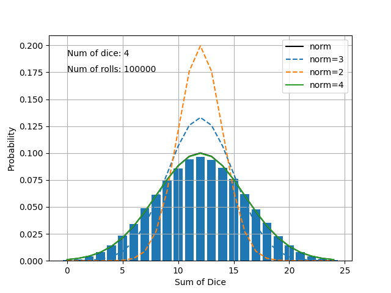

# statistics

### Normal distribution

Using a probability distribution of the sum of dice, 
I mapped it as so:

$$f(x) = \frac{1}{\sigma \sqrt{2\pi}}exp\left[-\frac{(x-\bar{x})^{2}}{2\sigma^{2}}\right]$$

